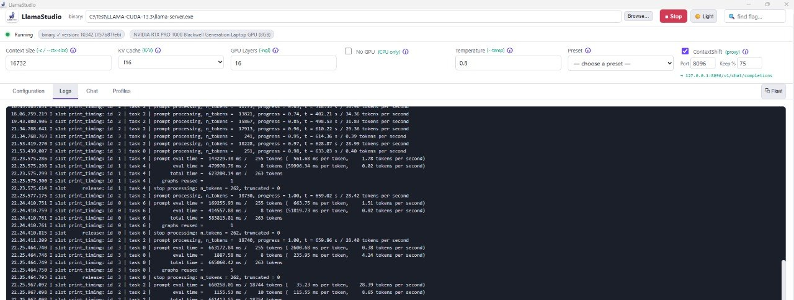

# 🦙 LlamaStudio

**A native desktop GUI for [llama.cpp](https://github.com/ggml-org/llama.cpp)'s `llama-server`**
— complete flag control, CUDA/GPU offload management, live log streaming, model
browsing, and a built-in chat panel.

Built with **Tauri v2 + React + Rust**. Runs fully offline / air-gapped.



**🌐 Project page:** https://avicho101.github.io/Llamastudio — **📦 Download:** [Releases](https://github.com/avicho101/Llamastudio/releases)

---

## ✨ Features

- 🖥️ **Full `llama-server` flag coverage** — every category is exposed:
  Model & Loading, CUDA/GPU Offload, Context & Batching, RoPE Scaling,
  Speculative Decoding, Sampling, Chat & Templates, Multimodal (Vision),
  Server & Network, Embeddings/Rerank, and Advanced/Logging.
- ⚡ **CUDA out of the box** — point it at your CUDA `llama-server.exe`, hit
  **Detect**, and it reports the binary's build info (CUDA version) and lists
  your NVIDIA GPUs + VRAM via `nvidia-smi` / WMI.
- 📜 **Live log streaming** — server stdout/stderr stream into the Logs tab in
  real time.
- 💬 **Chat panel** — talk to the running model via the OpenAI-compatible
  `/v1/chat/completions` endpoint.
- 📂 **Model browser** — scan a folder of `.gguf` files, click to select.
- 📋 **Command preview** — see the exact `llama-server` CLI it will run
  (copy it to run manually if you prefer).
- 🔌 **100% air-gapped** — no telemetry, no network calls on launch.
- 🖱️ **System tray + menu** — minimize to tray; right/left-click shows:
  Show/Hide, Start/Stop Server, **Swap Model** (submenu of your scanned
  `.gguf` files, current model marked ●), **Toggles** (Flash Attention,
  Web UI, Continuous Batching), and Quit.
- 🚀 **Branded splash screen** — shows briefly on launch, then the main
  window appears.
- 💾 **Profiles (`.llamaprofile`)** — save your whole config (every flag +
  model + binary) to a portable JSON file. Double-click it in Windows
  Explorer to reopen the exact setup. One click registers the file type
  (uses `assoc`/`ftype`); if it fails, re-run the app once as Administrator.
- 🌗 **Light & dark themes** — toggle in the top bar; light is the default.

---

## 🚀 Getting started

### 1. Get a `llama-server` binary (CUDA build)

**Option A — download a prebuilt CUDA binary** (easiest, needs internet once):
- Grab the latest CUDA `llama-server` from
  https://github.com/ggml-org/llama.cpp/releases
  (look for `cuda` / `cu12x` assets matching your CUDA version).
- Save `llama-server.exe` anywhere — you set the path in the app's top bar
  (Browse… → Detect).

**Option B — build it yourself** (fully offline-capable):
```bat
git clone https://github.com/ggml-org/llama.cpp
cd llama.cpp
cmake -B build -DGGML_CUDA=ON -DCMAKE_CUDA_ARCHITECTURES="120"
cmake --build build --config Release
```
`CMAKE_CUDA_ARCHITECTURES`: `120` = Blackwell (RTX PRO 1000), `89` = Ada,
`86` = Ampere, `61` = Pascal (Tesla P4), etc.

### 2. Install LlamaStudio

Download the latest installer from the **Releases** page — or build from
source (below).

### 3. Use it

1. **Top bar** → set the `llama-server` binary path (Browse… then Detect).
2. **Models Folder** (left) → Browse to your `.gguf` folder, hit **Scan**,
   click a model to select it.
3. Tweak flags per category (CUDA / GPU Offload is where you set
   `--n-gpu-layers`, `--flash-attn`, KV cache dtype, etc.).
4. Hit **▶ Start Server**. Watch the **Logs** tab.
5. Switch to **Chat** to talk to the model.
6. **■ Stop** when done.

The **Command preview** box always shows the exact CLI the app will run —
handy for debugging or running headless via scheduled tasks.

---

## 🔧 Building from source

Prerequisites (install once, with internet):
- **Rust** (stable): https://rustup.rs → `rustup default stable`
- **Node.js 20+**: https://nodejs.org
- **Visual Studio 2022 Build Tools** with:
  - "Desktop development with C++"
  - **MSVC v143 + Windows 11 SDK**
  - **C++ CMake tools for Windows**
- **WebView2** (ships with Win11; on Win10 install the runtime)
- (Optional, for CUDA builds) **CUDA Toolkit 12.x** + matching NVIDIA driver

```bat
cd llamastudio
npm install
npm run tauri build
```

Output: `src-tauri/target/release/bundle/msi/LlamaStudio_<version>_x64_en-US.msi`
(and a portable `LlamaStudio.exe` in `src-tauri/target/release/`).

> The target PC still needs the **NVIDIA driver + CUDA runtime** to actually
> use the GPU — that's a system dependency, not something the app downloads.

---

## 📁 Project layout

```
llamastudio/
├── package.json              # frontend deps + build scripts
├── vite.config.ts
├── index.html
├── src/
│   ├── main.tsx              # React entry
│   ├── App.tsx               # main UI (tabs, server controls, chat)
│   ├── splash.tsx            # splash screen
│   ├── FlagControl.tsx       # schema-driven per-flag input
│   ├── types.ts              # TS types + defaults
│   ├── tauri.ts              # safe Tauri invoke/dialog wrappers
│   └── styles.css            # themes (light + dark)
└── src-tauri/
    ├── Cargo.toml
    ├── tauri.conf.json
    ├── build.rs
    ├── icons/                # app icons
    └── src/
        ├── main.rs
        ├── lib.rs            # commands: start/stop/logs/devices/schema
        ├── nvidia.rs         # GPU detection (nvidia-smi / WMI)
        ├── jobobj.rs         # Windows Job Object (kill-on-close)
        ├── proxy.rs          # context-shift streaming proxy
        └── schema_server.rs  # authoritative flag schema
```

The flag schema is generated from the upstream `llama-server` `--help` so it
stays accurate. New flags can be added in `src-tauri/src/schema_server.rs`.

---

## ❓ Troubleshooting

| Symptom | Fix |
|---|---|
| "binary not set" | Set the `llama-server.exe` path in the top bar. |
| Server won't start | Check Logs tab; usually a bad model path or unsupported flag combo. |
| No GPU detected | Ensure CUDA driver installed; Detect uses `nvidia-smi`. |
| Out of VRAM on load | Lower `--n-gpu-layers` or raise `--fit-target` margin. |
| Chat returns 401 | Set `--api-key` in the app, or leave it empty for no auth. |

---

## 📄 License

[MIT](LICENSE) © 2026 Avraham (avicho101)
